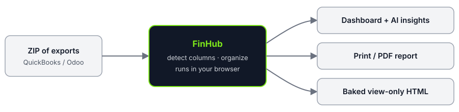

<p align="center"></p>

# FinHub



FinHub turns QuickBooks and Odoo report exports into an interactive financial review package: dashboard, full reports, optional AI commentary, a print/PDF report, and a shareable view-only HTML file. A LAZLAB Creations app.

## Live
- Landing: https://johnlaz.github.io/finhub/
- App: https://johnlaz.github.io/finhub/app/

## Using it
1. Export A/R aging, A/P aging, Balance Sheet, Profit & Loss and Trial Balance from QuickBooks or Odoo.
2. Zip them and load the ZIP in **Load Data** (file names are matched loosely, e.g. `ar.xlsx`, `balance sheet*`, `trial*`).
3. Review the dashboard and reports, then **Print / PDF** or **Bake HTML** to share a view-only copy.

## Repo layout
```
/index.html          landing page
/README.md
/docs/               README SVGs only
/app/index.html      the app (single file)
/app/manifest.json   PWA manifest (scope /app/)
/app/sw.js           service worker (cache finhub-v<version>)
/app/icon-192.png
/app/icon-512.png
```
Theme colors are defined as CSS variables in `:root` of **both** `/index.html` and `/app/index.html`. Keep them identical.

## AI / model setup (optional)
FinHub uses Groq with your own key. Open **Settings → AI Analysis**, paste a key from https://console.groq.com and press **Save**. The model list loads automatically and can be reloaded with **Refresh Models**. Pick a model to enable **Analyze**. A previously saved model that Groq no longer lists is kept and flagged, never swapped silently.

## Data & privacy
Files are parsed in your browser. Nothing is sent to a FinHub server. Only your Groq key and chosen model are stored (localStorage). If AI is enabled, a summary of the figures is sent to Groq with your key. Baked HTML files are view-only and contain the loaded data.

## Deploy / update
GitHub Pages from the repo root. When shipping a change, bump `APP_VERSION` in `/app/index.html` **and** `VERSION` in `/app/sw.js` so installed copies update. Installed users see a "FinHub updated" prompt.

## Changelog
- **1.1.0** — Renamed FinHub, new icon, landing page, installable PWA with offline support, version stamp, model list refreshes on key save, copyright footer.
- **1.0** — Initial financial review package.

© 2026 LAZLAB Creations. All Rights Reserved. · lazlab.io@gmail.com
